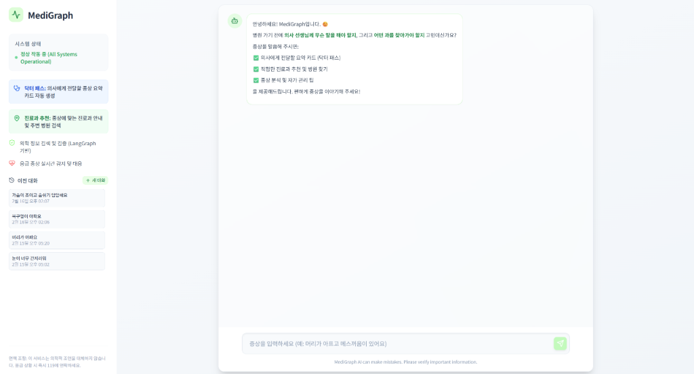
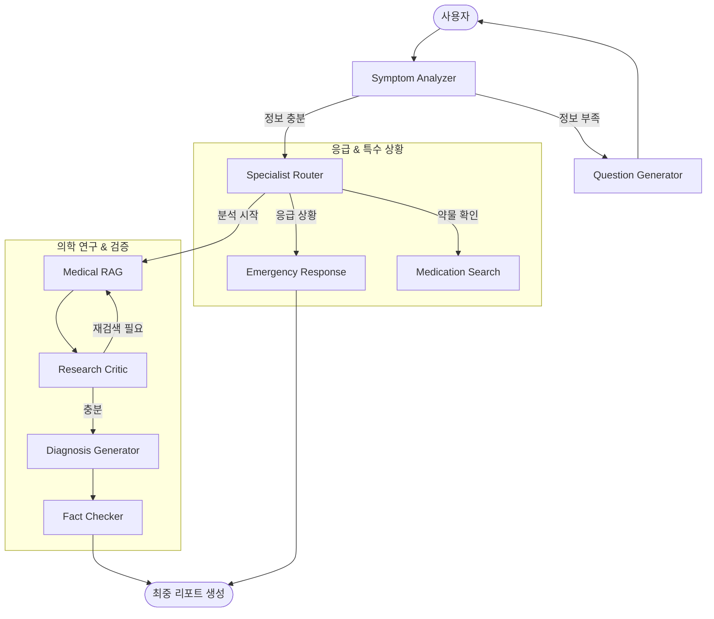
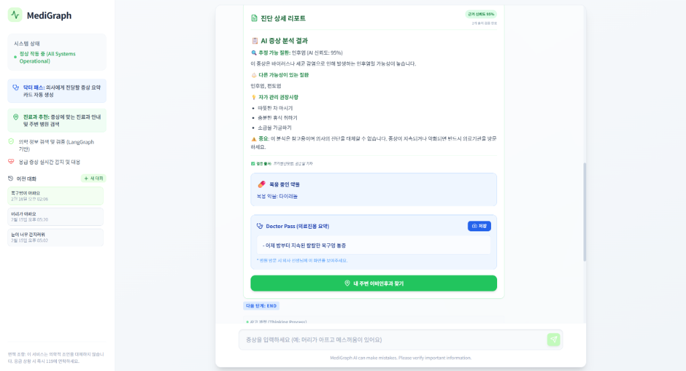
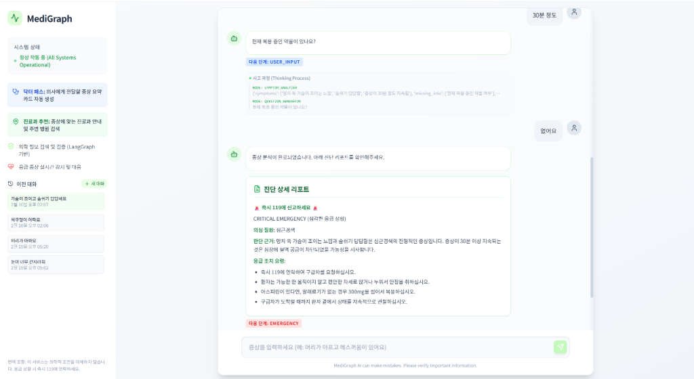

<div align="center">
  
  <h1>🩺 MediGraph</h1>
  <p><b>LangGraph 기반 지능형 의료 진단 및 팩트체크 멀티 에이전트 시스템</b></p>

  <div>
    
    
    
    
    
  </div>
</div>

---

## 🔒 Security & Privacy (Privacy-First)

의료 데이터의 민감성을 고려하여, MediGraph는 다음과 같은 보안 원칙을 준수합니다.

- **로컬 데이터 암호화**: 사용자의 모든 대화 내역 및 증상 기록은 브라우저의 `LocalStorage`에 저장되기 전, **AES-GCM (Web Crypto API)** 알고리즘을 통해 실시간으로 암호화됩니다.
- **서버 무저장 원칙**: 백엔드 서버는 대화의 흐름을 제어하기 위한 일시적인 상태(State)만 관리하며, 사용자의 개인 식별 정보나 민감한 의료 상담 내역을 별도의 데이터베이스에 영구적으로 저장하지 않습니다.
- **클라이언트 사이드 복호화**: 데이터의 복호화는 오직 사용자의 브라우저 내에서만 이루어지며, 외부로 암호 키가 유출되지 않도록 설계되었습니다.

---

## 🌟 개요

**MediGraph**는 단순한 챗봇을 넘어, 복잡한 의료 진단 과정을 정교한 **Multi-agent 워크플로우**로 구현한 지능형 에이전트입니다. LangGraph를 통해 각 단계별로 특화된 에이전트들이 협력하여, 환자의 안전을 최우선으로 하고 의사와의 소통을 돕는 객관적인 데이터를 생성합니다.

## ✨ 핵심 기능

### 🛡️ **지능형 문진 & 응급 감지**
- **Symptom Analyzer**: 사용자의 초기 증상을 분석하고, 진단에 필수적인 정보(위치, 양상, 지속 시간 등)가 부족할 경우 추가 질문을 자동으로 유도합니다.
- **Emergency Monitor**: 흉통, 호흡 곤란 등 골든타임이 중요한 위험 징후 포착 시 **즉각적으로 119 신고 가이드**를 제시합니다.

### 🔍 **RAG 기반 팩트 체크**
- **Tavily Search** 연동을 통해 최신 의학 정보를 수집합니다.
- **Research Critic**: 수집된 정보가 충분한지 AI가 스스로 평가하고, 부족할 경우 검색 쿼리를 수정하여 재검색을 수행합니다.
- **Fact Checker**: 최종 진단 가설을 의학적 가이드라인과 대조하여 **근거 신뢰도(Fact-check Confidence)**를 산출합니다.

### 📋 **닥터 패스 (Doctor Pass)**
- 환자의 주관적 표현을 의료진이 이해하기 쉬운 **객관적 히스토리**로 변환합니다.
- AI의 진단 의견을 완전히 배제한 '사실 중심 요약'을 통해 진료의 효율성을 극대화합니다.

---

## 🏗️ AI 워크플로우 기술 심화 (Deep Dive)

MediGraph의 핵심은 **Stateful Multi-agent 시스템**입니다. 각 노드는 독립적인 역할을 수행하며 공유된 `State`를 기반으로 의사결정을 내립니다.

### 🔄 **에이전트 워크플로우 아키텍처**



### 🧠 **주요 기술적 해결 포인트**
1. **Persona Fluff Filter**: 사용자가 불필요하다고 판단하는 AI의 상투적인 공감 멘트(예: "많이 불편하시겠어요")를 정규식 기반 후처리 필터로 완벽하게 제거했습니다.
2. **Reliability Guard**: LLM의 할루시네이션(환각)을 방지하기 위해, RAG로 수집된 근거와 최종 진단 사이의 일치도를 별도의 노드에서 검증하는 'Self-Correction' 루프를 구현했습니다.
3. **Strict Fact-Check**: 닥터패스 요약 카드 생성 시 `AI Opinion`과 `Patient Fact`를 엄격하게 분리하도록 프롬프트 엔지니어링을 적용했습니다.

---

## 📂 프로젝트 구조 (Project Structure)

```text
medicalLLM/
├── src/
│   ├── api.py              # FastAPI 서버 엔드포인트
│   ├── graph.py            # LangGraph 워크플로우 정의 및 노드 연결
│   ├── state.py            # 에이전트 상태(State) 스키마 정의
│   ├── nodes/              # 각 단계별 에이전트(Node) 로직
│   │   ├── symptom_analyzer.py
│   │   ├── question_generator.py
│   │   ├── diagnosis_generator.py
│   │   ├── fact_checker.py
│   │   ├── emergency.py
│   │   └── node_utils.py   # 페르소나 필터 및 공통 유틸리티
│   └── utils/
│       ├── llm.py          # LLM 설정 및 캐싱
│       └── crypto.js       # (Frontend 연동) 데이터 암호화
├── client/                 # React (Vite) 프론트엔드
│   ├── src/
│   │   ├── components/     # UI 컴포넌트 (Chat, Modal 등)
│   │   └── utils/          # LocalStorage 암호화 로직
└── README.md
```

---

## 📷 스크린샷

<table style="width: 100%;">
  <tr>
    <td align="center"><b>환영 인사 및 초기화면</b></td>
    <td align="center"><b>지능형 진단 리포트</b></td>
  </tr>
  <tr>
    <td></td>
    <td></td>
  </tr>
  <tr>
    <td align="center" colspan="2"><b>🚨 응급 상황 즉각 대응</b></td>
  </tr>
  <tr>
    <td align="center" colspan="2"></td>
  </tr>
</table>

---

## ⚙️ 설치 및 실행

### Backend (Python)
1. `.env` 파일에 API 키 설정 (`OPENAI_API_KEY`, `TAVILY_API_KEY`)
2. 의존성 설치: `pip install -r requirements.txt`
3. 서버 실행: `uvicorn src.api:app --reload`

### Frontend (React)
1. `npm install`
2. `npm run dev`

---

## 🗺️ 향후 로드맵
- [ ] **멀티모달 진단**: 환부 사진 촬영 및 분석 기능 추가
- [ ] **OCR 영수증 분석**: 약국 처방전/성분 분석 자동화

---

## ⚖️ Disclaimer
본 서비스는 AI 기술을 활용한 보조 도구이며, 어떠한 경우에도 전문 의사의 진단을 대체할 수 없습니다. 위급 상황 시 반드시 119 혹은 인근 응급실을 방문하시기 바랍니다.
