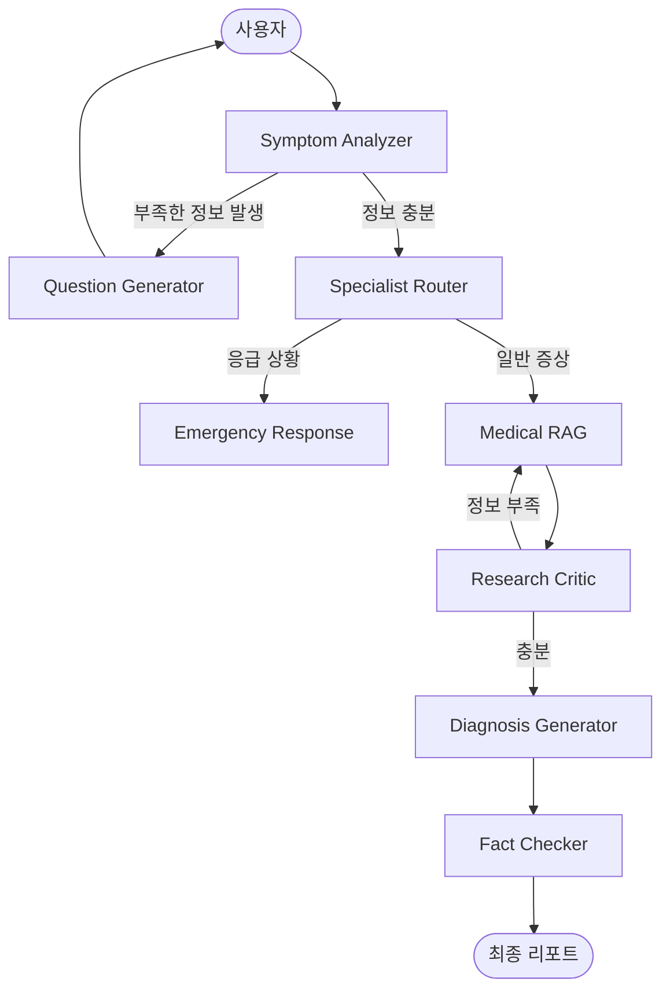

  
  <h1>🩺 MediGraph</h1>
  
<b>LangGraph 기반 지능형 의료 진단 및 팩트체크 시스템</b>

  

    
    
    
    
    
  

---

## 🔒 Security & Privacy (Privacy-First)

의료 데이터의 민감성을 고려하여, MediGraph는 다음과 같은 보안 원칙을 준수합니다.

- **로컬 데이터 암호화**: 사용자의 모든 대화 내역 및 증상 기록은 브라우저의 `LocalStorage`에 저장되기 전, **AES-GCM (Web Crypto API)** 알고리즘을 통해 실시간으로 암호화됩니다.
- **서버 무저장 원칙**: 백엔드 서버는 대화의 흐름을 제어하기 위한 일시적인 상태(State)만 관리하며, 사용자의 개인 식별 정보나 민감한 의료 상담 내역을 별도의 데이터베이스에 영구적으로 저장하지 않습니다.
- **클라이언트 사이드 복호화**: 데이터의 복호화는 오직 사용자의 브라우저 내에서만 이루어지며, 외부로 암호 키가 유출되지 않도록 설계되었습니다.

---

## 🌟 개요

**MediGraph**는 단순한 챗봇을 넘어, 복잡한 의료 진단 과정을 정교한 **Multi-agent 워크플로우**로 구현한 지능형 에이전트입니다. 환자의 안전을 최우선으로 하며, 의사와의 소통을 돕는 객관적인 데이터를 생성합니다.

## ✨ 핵심 기능

### 🛡️ **지능형 문진 & 응급 감지**
- **Symptom Analyzer**: 초기 증상을 분석하고 부족한 정보가 있을 경우 추가 질문을 자동으로 생성합니다.
- **Emergency Monitor**: 흉통, 호흡 곤란 등 위험 징후 포착 시 **즉각적으로 119 신고 가이드**를 제시합니다.

### 🔍 **RAG 기반 팩트 체크**
- 검색된 의학적 근거가 충분한지 AI가 스스로 평가(Critic)하고 부족할 경우 재검색을 수행합니다.
- 최종 진단은 실제 논문 및 가이드라인과 대조되어 **근거 신뢰도(Fact-check Confidence)**가 부여됩니다.

### 📋 **닥터 패스 (Doctor Pass)**
- 환자의 주관적 표현을 의료진이 이해하기 쉬운 **객관적 히스토리**로 변환합니다.
- 진단 의견을 배제한 '사실 중심 요약'으로 진료 효율성을 극대화합니다.

---

## 🏗️ 시스템 아키텍처

---

## 📷 스크린샷

<table style="width: 100%;">
  <tr>
    <td align="center"><b>환영 인사 및 초기화면</b></td>
    <td align="center"><b>지능형 진단 리포트</b></td>
  </tr>
  <tr>
    <td></td>
    <td></td>
  </tr>
  <tr>
    <td align="center" colspan="2"><b>🚨 응급 상황 즉각 대응</b></td>
  </tr>
  <tr>
    <td align="center" colspan="2"></td>
  </tr>
</table>

---

## ⚙️ 설치 및 실행

### Backend (Python)
1. `.env` 파일에 API 키 설정 (`OPENAI_API_KEY`, `TAVILY_API_KEY`)
2. 의존성 설치: `pip install -r requirements.txt`
3. 서버 실행: `uvicorn src.api:app --reload`

### Frontend (React)
1. `npm install`
2. `npm run dev`

---

## ⚖️ Disclaimer
본 서비스는 AI 기술을 활용한 보조 도구이며, 어떠한 경우에도 전문 의사의 진단을 대체할 수 없습니다. 위급 상황 시 반드시 119 혹은 인근 응급실을 방문하시기 바랍니다.
